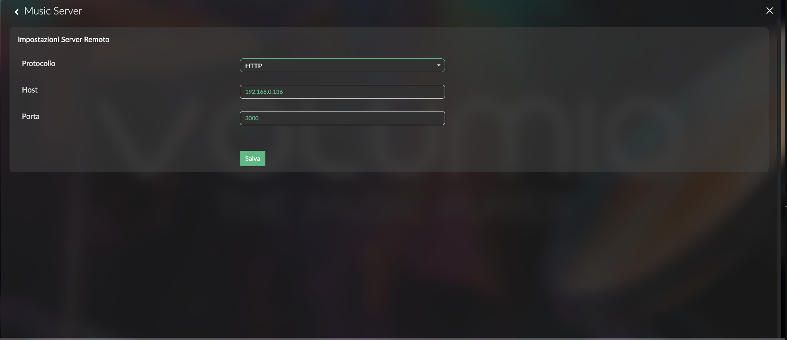

# Music Server

This repo is the entry point for the Music Server project, a Typescript native, plugin based Music Server.

The scope of this repo is to give you the necessary information for using the software and possibly contribute to it.

## Repositories

- Backend: This repository contains the core part of the project, the only one you really need. Repo: https://github.com/fanciulli/musicserver-backend
- Admin-Ui: This repository contains an administrative web interface for some basic configuration tasks. Repo: https://github.com/fanciulli/musicserver-admin-ui
- Volumio Plugin: This repository contains a plugin for Volumio. The plugin allows connecting Volumio to the Music Server via its APIs. Repo: https://github.com/fanciulli/musicserver-volumio-plugin

## Dependencies

Music Server requires a MongoDB server for storing data. If you already have an instance you can confiugre Music Server to connect to it otherwise you can run a new one. The `docker-compose.yml` file in this repository will start one for you.

## Quick start

If you want to quickly start testing Music Server you can use the Docker Compose file in this repository.
Open the file `docker-compose.yml` and modify the `/change/me` to a local path where music is stored. Save the file and run it with

```
docker compose pull
docker compose -f docker-compose.yml up -d
```

Open the browser of your choice and go to `http://localhost:3001`. The Administrative UI is shown to you.
In the plugins section click on the `Scan` button next to the File System plugin to scan for song, albums and artists.

### Volumio plugin

The Music Server has Rest APIs that you can use to browse content, search by text and stream songs. If you plan to use with Volumio connect to it via SSH and perform the following:

```
cd /data/plugins/music_service
git clone https://github.com/fanciulli/musicserver-volumio-plugin.git musicserver
cd musicserver
npm install
```

Now edit the file `plugins.json` under /data/plugins in order to add the following under the field `music_service`:

```
"musciserver": {
     	"enabled": {
        "type": "boolean",
        "value": true
}
```

Restart Volumio. In Volumio UI go to Plugins > Music Server and click on `Settings`. The configuration page is shown. Update it based on your current environment:



Restart Volumio. The Browse shall now show a new source.

## Desktop packages (Tauri)

As an alternative to Docker, Music Server can be shipped as native desktop
applications built with [Tauri v2](https://v2.tauri.app/). There are **two
separate packages** (see issue
[#110](https://github.com/fanciulli/musicserver-backend/issues/110)):

- **Backend** — bundles the Music Server backend and MongoDB. It shows no admin
  UI: it runs in the system tray (with a small status window) and exposes the
  API on port `3000`.
- **Frontend** — bundles the admin UI and shows it as a desktop application,
  connecting to the backend over the network.

All packaging code lives in this repository under `packaging/tauri/`. See
[`packaging/tauri/README.md`](./packaging/tauri/README.md) for full build
instructions and [`docs/packaging/2026-06-17-tauri-packaging-design.md`](./docs/packaging/2026-06-17-tauri-packaging-design.md)
for the design rationale.

### Quick build (current platform)

```bash
# Backend package (backend + MongoDB)
cd packaging/tauri/backend
npm install
npm run build        # runs prepare-sidecars then `tauri build`

# Frontend package (admin UI)
cd ../frontend
npm install
npm run build
```

Installers/bundles are produced under
`packaging/tauri/<app>/src-tauri/target/release/bundle/`.

Building Tauri apps requires the Rust toolchain and each platform's native
webview prerequisites — see the packaging README for the full list.
